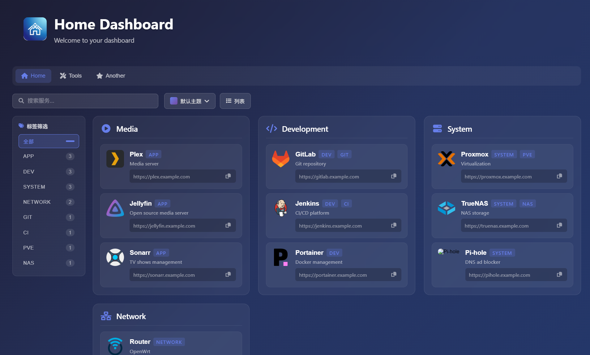

# HomePageX

一个非常轻量的类似 Homer 的导航主页，使用 Go + Svelte 实现。

## 功能特性

- **YAML 配置**: 类似 Homer 的 YAML 格式定义页面链接
- **多页面支持**: `/` 对应 `home.yaml`，`/another` 对应 `another.yaml`
- **视图切换**: 支持卡片视图和列表视图切换
- **内置过滤**: 支持按标题，描述，标签过滤服务项
- **Basic 认证**: 可配置的用户名/密码验证
- **FontAwesome 图标**: 支持 FontAwesome 图标
- **响应式设计**: 适配桌面和移动设备

## 效果预览



## 快速开始

下载 Github release 最新版本:

```bash
wget https://github.com/inhere/go-homepagex/releases/latest/download/homepagex-linux-amd64
```

## 项目结构

```txt
go-homepagex/
├── internal/          # Go 后端服务
│   ├── config.go     # 配置加载
│   ├── page.go       # 页面配置解析
│   ├── auth.go       # Basic 认证
│   └── handlers.go   # HTTP 处理器
├── frontend/         # 前端应用
│   └── build/        # 构建输出
│       ├── index.html
│       └── app.js
├── pages/            # 页面 YAML 配置
│   ├── home.yaml     # 主页面配置
│   └── another.yaml
├── config.yaml   # 后端配置
├── main.go       # Go 入口文件
└── README.md
```

## 配置说明

### 后端配置 (config.yaml)

```yaml
server:
  port: "8090"

# Basic 认证配置
auth:
  enabled: true
  username: "admin"
  password: "your-password"

# 页面配置文件存放目录
pages_dir: "./pages"

# 前端构建目录
frontend_dir: "./frontend/build"
```

#### 认证配置

格式为 `{username}:{password}@{path:perm},{path2:perm2}`

- 使用 `@` 分隔账号和路径。无账号表示匿名用户。
- 使用 `:` 分隔用户名和密码。
- 使用 `,` 分隔多个路径。
- 使用路径后缀 `:rw`/`:ro` 设置权限：`读写`/`只读`。`:ro` 可省略。
- 路径可以使用通配符 `*` 表示任意路径，不带 `*` 表示精确匹配
- 路径可以使用前缀 `!` 表示排除路径

> [!NOTE] 权限按页面配置，有页面的权限就有对应 api 的权限

- `admin:admin@*:rw` admin 具有所有路径的完整权限。
- `guest:guest@*` guest 具有所有路径的只读权限。
- `user:pass@*:rw,/dir1/*` user 对 `/*` 具有读写权限，对 `/dir1/*` 具有只读权限。
- `@*` 所有路径公开访问，任何人都可以查看。

### 页面配置 (pages/main.yaml)

```yaml
title: "Home Dashboard"
subtitle: "Welcome to your dashboard"
logo: "logo.png"

theme: "default"
color: "blue"
style: "cards"  # cards 或 list
columns: "3"

connectivity:
  check_interval: 30000
  mode: "ping"

services:
  - name: "Media"
    icon: "fas fa-play-circle"
    items:
      - name: "Plex"
        logo: "https://example.com/plex.png"
        subtitle: "Media server"
        tags: ["app"]
        url: "https://plex.example.com"
        target: "_blank"
```

## 页面配置规则

- `/` 路由对应 `pages/home.yaml`
- `/another` 路由对应 `pages/another.yaml`
- 依此类推: `/{name}` -> `/pages/{name}.yaml`

## 开发

### 1. 安装依赖

**Go (1.21+)**:
```bash
# 下载并安装 Go
wget https://go.dev/dl/go1.21.6.linux-amd64.tar.gz
sudo tar -C /usr/local -xzf go1.21.6.linux-amd64.tar.gz
export PATH=$PATH:/usr/local/go/bin
```

### 2. 编译后端

```bash
go mod tidy
go build -o homepagex
```

### 3. 运行

```bash
# 使用默认配置
./homepagex

# 或使用自定义配置文件
./homepagex /path/to/config.yaml
```

### 4. 访问

打开浏览器访问: http://localhost:8080

### 前端开发

前端使用 Svelte 框架。

#### 1. 安装依赖

```bash
cd frontend
pnpm install
```

#### 2. 开发模式

```bash
pnpm run dev
```

#### 3. 构建

```bash
pnpm run build
```

## 图标

支持 FontAwesome 图标:
- 使用 `fas fa-icon-name` 格式
- 完整图标列表: https://fontawesome.com/icons

## 许可证

MIT
